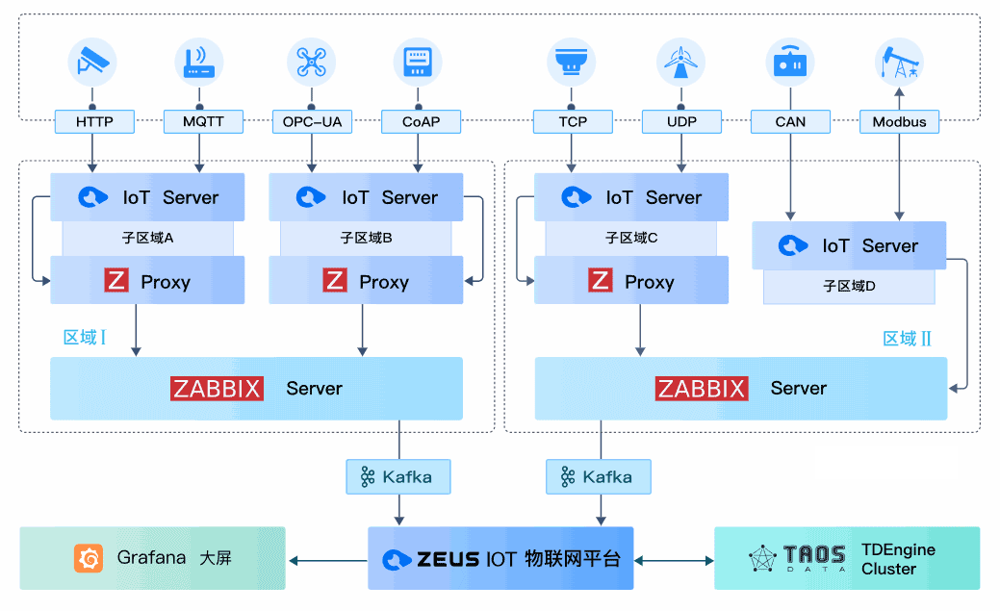

<p align="center">

</p>

<p align="center">
<b>Zeus IoT is the world's first open source IoT <i>distributed collection platform</i> based on Zabbix</b>
</p>

----

[](https://github.com/zmops/zeus-iot)
[](https://github.com/zmops/zeus-iot)
[](https://github.com/zmops/zeus-iot)

[](https://qm.qq.com/cgi-bin/qm/qr?k=CcWBdkXjkgt99bBu5d_-1TeS36DhCkU4&jump_from=webapi)

## Abstract
[Zeus IoT](https://www.zmops.com/) is a **distributed IoT collection, analysis, and storage platform**,It is the world's first IoT open source platform based on zabbix secondary development, all this relies on a group of engineers with rich experience in zabbix development.It is hoped that through the community’s open source ecology, continuous improvement and continuous updates will make some contributions to the development of the Internet of Things industry.

The following screenshots give a close insight into Zeus IoT.
<table>
  <tr>
      <td width="50%" align="center"><b>Home Screen</b></td>
      <td width="50%" align="center"><b>Device Resources</b></td>
  </tr>
  <tr>
     <td></td>
     <td></td>
  </tr>
  <tr>
      <td width="50%" align="center"><b>Realtime Data</b></td>
      <td width="50%" align="center"><b>System Users</b></td>
  </tr>
  <tr>
     <td></td>
     <td></td>
  </tr>
</table>

## Technology stack
- Basic components: **Zabbix 5.4+**
- Database: **PostgreSQL12+ , TDEngine 2.2+**
- Webapp: **SpringBoot 2  ,  [Ebean](https://ebean.io/)  ,  Vue Element , Socket.IO**
- IoT Server: **Apache Camel 2.2 , Modular design**
- Visualization: **Grafana 8.0+**

## Features
<details>
  <summary><b>🏆Based on <i>zabbix</i> secondary development</b></summary>
  Based on the powerful <a href="http://www.zabbix.com">Zabbix</a> for interface secondary development, with industrial-grade stability and powerful performance.
</details>
<details>
  <summary><b>🥇Based on <i>Apache Camel</i> as the pre-routing rule</b></summary>
  Very powerful rule-based routing engine, supports 300+ module access, including IoT protocols, born for low code; one line of code can start the protocol service interface.
</details>
<details>
  <summary><b>🥉Use <i>TDEngine</i> for time series data storage by default</b></summary>
  <a href="https://www.taosdata.com/">TDEngine</a> is an ultra-high performance distributed database designed and optimized for time series data.
</details>
<details>
  <summary><b>⚔️IoT Server is developed with a <i>modular architecture</i></b></summary>
  IoT Server adopts the <a href="https://github.com/apache/skywalking">Skywalking</a> modular architecture design, which can dynamically configure and enable modules, which is very easy to expand; at the same time, combined with the multi-point collection of Zabbix Proxy, a modular cluster can be implemented well.
</details>
<details>
  <summary><b>🏹Natural distributed collection architecture</b></summary>
  Thanks to Zabbix's excellent architecture design, it has natural distributed collection capabilities, can be well horizontally expanded, and has the ability to cross-region and cross-network collection
</details>

## Architecture



---

## Installation
The Zeus IoT production environment can only be installed on a Linux system, either Centos7 or Ubuntu 18.04. In the development and test environment: The IoT Server service can be developed and debugged in the Windows environment.

### Quick Start
- Centos7/Redhat7

  ```shell
  curl -L https://github.com/zmops/zeus-iot/raw/develop/docs/centos/install.sh | bash
  ```

- Ubuntu 18.04

  ```shell
   curl -L https://github.com/zmops/zeus-iot/raw/develop/docs/ubuntu/install.sh | bash
  ```
After Zeus IoT is successfully installed, you can use http://IP:9090 to access the ZeusIoT Console with the default account and password (Admin/zabbix).

> 
## Demo Environment

Using the account `Admin / zeus123` to log in the [demo environment](https://zeusdemo.zmops.cn/). Please note the account is granted view access. 